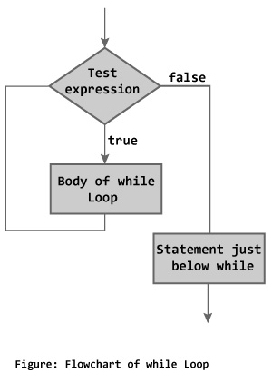
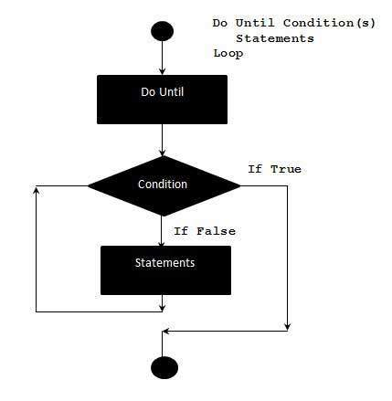

There are different loops including while loop, untill loop and for loop.

## While loops

While loop will keep executing commands until if an expression is true. It looks like:

>      while [ <some test> ]
>      do
>          <commands>
>      done



A simple example would be print all the integer from 1 to 10:

```
#!/bin/bash
# while_loop.sh

counter=1
while [ $counter -le 10 ]
do
  echo $counter
  ((counter++))
done

echo All done
```

Using the double brackets we can increase the value of counter by 1.

~~~
user@bash: ./while_loop.sh
1
2
3
4
5
6
7
8
9
10
All done
~~~
{: .output}

## Until loops

The until loops are similar to while loop. The difference is that it will execute the commands until the test become true.

>      until [ <some test> ]
>      do
>          <commands>
>      done



The same script written in until loop would looks like this:

```
#!/bin/bash
# until_loop.sh

counter=1
until [ $counter -gt 10 ]
do
  echo $counter
  ((counter++))
done

echo All done
```

Generally, there are no differences between while loops and until loops. Which one to use is really a personal favor.

## For loop

For loops are a little different to the previous two types of loops. It says that given a list of items, perform the same set of commands to each of them.

>      for var in <list>
>      do
>          <commands>
>      done

The for loop will take each item in the list (in order, one after the other), assign that item as the value of the variable var, execute the commands between do and done then go back to the top, grab the next item in the list and repeat over.

The list can be a series of strings, separated by spaces.

A simple example:

```
#!/bin/bash
# for_loop.sh

names='Stan Kyle Cartman'

for name in $names
do
  echo $name
done

echo All done
```

The list can also be a series of number.

```
#!/bin/bash
# for_loop.sh

for value in {1..5}
do
  echo $value
done

echo All done
```

One of the more useful applications of for loops is in the processing of a set of files. To do this we may use wildcards.

Let's say we want to backup all .html files to another directory.

```
#!/bin/bash
# Make a backup copy of any html files

for value in $1/*.html
do
  cp $value ./backup/
done
```

## Control loop using break and continue

Sometimes you may want to get out of loop or skip loops, when your code has encountered fatal mistakes or errors.

### Break

The break statement tells Bash to leave the loop straight away. It may be that there is a normal situation that should cause the loop to end but there are also exceptional situations in which it should end as well. For instance, maybe we are copying files but if the free disk space get's below a certain level we should stop copying.

```
#!/bin/bash
# copy_files.sh

for value in $1/*
do
  used=$( df $1 | tail -1 | awk '{ print $5 }' | sed 's/%//' )
  if [ $used -gt 90 ]
  then
    echo Low disk space 1>&2
    break
  fi
  cp $value $1/backup/
done
```

### Continue

The continue statement tells Bash to stop running through this iteration of the loop and begin the next iteration. Sometimes there are circumstances that that stop us from going any further. For instance, maybe we are using the loop to process a series of files but if we happen upon a file which we don't have the read permission for we should not try to process it.

```
#!/bin/bash
# copy_check.sh

for value in $1/*
do
  if [ ! -r $value ]
  then
    echo $value not readable 1>&2
    continue
  fi
  cp $value $1/backup/
done
```

> ## Exercise
>
> Write a script that:
>  
> 1. Takes 2 command line arguments which stands for a range of integers(including these two integers).
>
> 2. Prints all the integers in the range and whether it is a even or odd number.
>
> > ## Solution
> >
> > Hint:
> >
> > You might want to use a variate of for loop: `for ((i=0;i<=10;i++))`
> >
> {: .solution}
{: .challenge}
